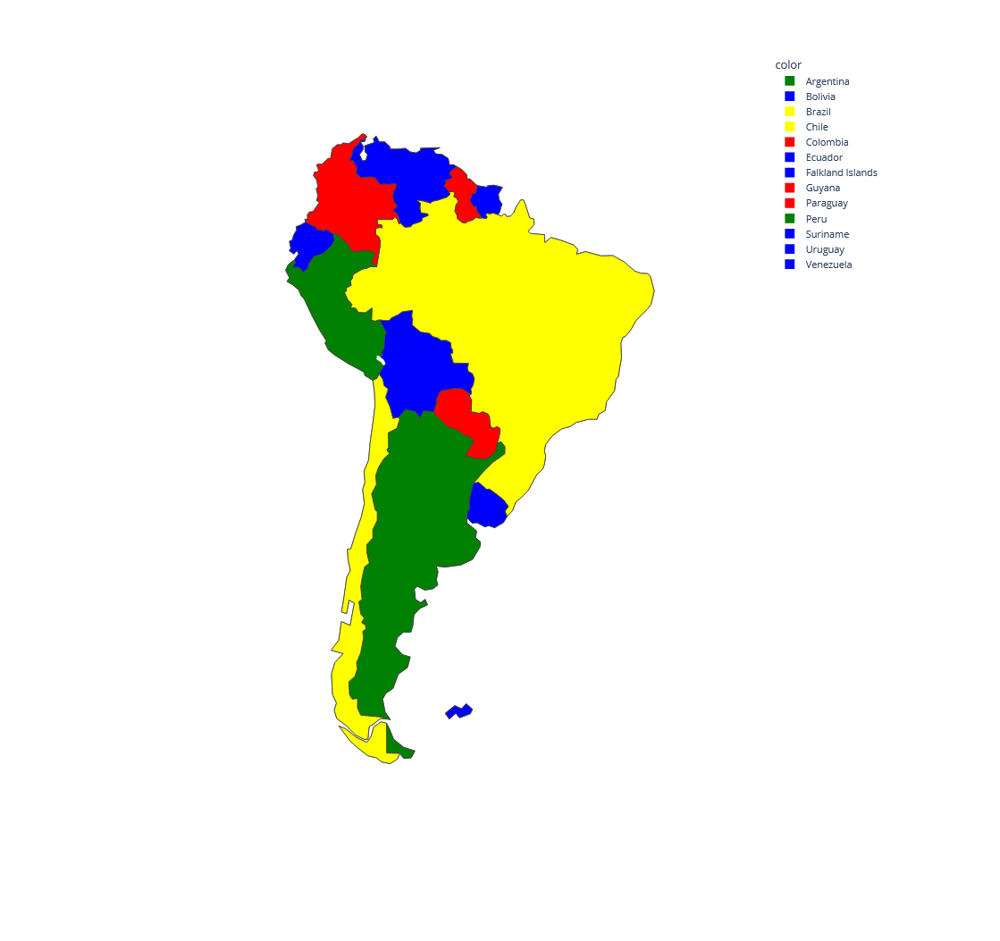

# Color Map

Coloring a map such as no two neighbors use the same color. An assignment on Artificial Intelligence.

Given a set of countries and list of their neighbors, the program creates a graph data structure and solves the map coloring problem in an iterative fashion.

It then plots the resulting map as follows:

## Dependencies

* plotly

* pandas

